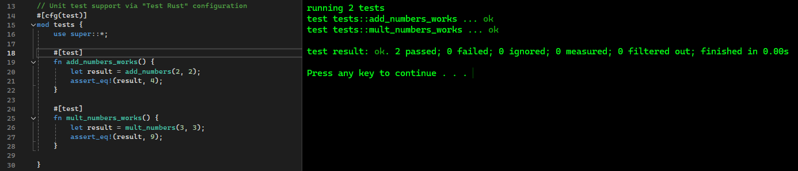

# Abomination

**Abomination** is a Visual Studio solution template designed to seamlessly integrate Rust library development into code that can be called from C/C++ on Windows (x86_64). It sets up a workflow where you write core logic in Rust, expose it via C-style function prototypes, and then consume it in a C++ application.

## Overview

This template is structured into three main parts:

1. **Abomination.cpp**  
   This is the primary C++ source file containing the `main()` function. It invokes functions implemented in Rust by including and calling prototypes declared in `Rust.h`.

2. **Rust.h**  
   This header file declares the C-compatible function prototypes for Rust functions. These functions are defined and exported from the Rust library and then called from `Abomination.cpp`.

3. **Mutations (Rust Cargo Project)**  
   The `Mutations` directory is a standalone Rust Cargo project that compiles into a static library.  
   - **lib.rs**: This file contains the core Rust code and the `#[no_mangle]` exported functions. By default, a few example functions and unit tests are provided.
   - Any additional `.rs` source files must be manually added to the `Mutations/src` directory (or another directory structure as you prefer) and then referenced in `lib.rs` or via Rust `mod` declarations.

## Intended Workflow

1. **Develop in Rust**:  
   Implement your core functionality in Rust within the `Mutations` project. Begin by editing `lib.rs` and adding new functions that will be exposed to C++. For each new Rust function you plan to call from C++, ensure it has the `#[no_mangle]` and `extern "C"` attributes, and is compiled with a `pub` visibility.

   **Example:**
   ```rust
   #[no_mangle]
   pub extern "C" fn add_numbers(a: u64, b: u64) -> u64 {
       a + b
   }
   ```

2. **Declare in C (Rust.h)**:  
   After creating (or updating) a function in Rust, add a corresponding C-style function prototype in `Rust.h`.

   **Example:**
   ```c
    #pragma once

    /* Rust.h
    * C-style prototype declerations of the functions implemented in lib.rs
    */

    extern "C" unsigned long long add_numbers(unsigned long long a, unsigned long long b);
    extern "C" unsigned long long mult_numbers (unsigned long long a, unsigned long long b);
   ```

3. **Call From C++ (Abomination.cpp)**:  
   With the function declared in `Rust.h`, you can now safely call it from `Abomination.cpp`.

   **Example:**
   ```cpp
    #include <iostream>
    #include "Rust.h"

    int main()
    {
        constexpr unsigned long long a = 2;
        constexpr unsigned long long b = 3;

        unsigned long long c = add_numbers(a, b);

        std::cout << "Hello World!\n";
        std::cout << "Output of add:" << c << "\n";
        std::cout << "Output of mult:" << mult_numbers(a, b) << "\n";
    }
   ```

4. **Build and Run**:  
   - Set the active configuration to your desired build mode (e.g., `Debug` or `Release`).
   - Build the solution in Visual Studio. The Rust library will be compiled into a static library, and `Abomination.cpp` will link against it.
   - Run the executable from within Visual Studio or directly from the build output directory.

5. **Add More Rust Source Files**:  
   If you need more complex Rust modules, add `.rs` files under `Mutations/src` (or a structured layout of your choosing), and reference them from `lib.rs` using Rust’s module system:
   ```rust
   // In lib.rs
   mod my_module; // references my_module.rs in src/
   ```
   Rebuild the solution after adjusting your code and prototypes as needed.

## Rust Unit Testing

This template includes a "Test Rust" configuration. Running it will:

- Invoke `cargo test` within the `Mutations` project directory.
- Execute the Rust-based unit tests defined in `lib.rs` (and any other modules).

**How to run Rust tests:**

1. Switch to the `Test Rust` configuration in Visual Studio.
2. Build and run to execute the Rust unit tests directly from within the IDE’s output window.



When you finish testing, switch back to a standard C++ configuration (like `Debug` or `Release`) to continue normal development.

## Prerequisites

- **Windows (x86_64)** with Visual Studio installed.
- **Rust toolchain** (with `cargo`) installed and accessible in your system PATH.  
  [Install Rust](https://www.rust-lang.org/tools/install)

## Notes

- The template assumes the Rust static library name and paths are consistent with `Mutations` project settings.
- Make sure to keep your `#[no_mangle]` and `extern "C"` attributes aligned with any functions you want to expose. The function signature in Rust must match the C prototype in `Rust.h`.
- Adjust compiler flags, optimization levels, or calling conventions as needed in both the Rust Cargo settings (`Cargo.toml`) and the Visual Studio project properties.
- **The current template does not support directly debugging Rust code from Visual Studio.**

## Contributing & Support

If you encounter issues integrating Rust and C/C++ code, consider the following resources:

- [The Rust FFI Omnibus](http://jakegoulding.com/rust-ffi-omnibus/)
- [Rust Book - FFI Chapter](https://doc.rust-lang.org/1.30.0/book/second-edition/ch19-01-unsafe-rust.html#accessing-or-modifying-a-mutable-static-variable)
- [Visual Studio C++ Documentation](https://learn.microsoft.com/cpp/)

Please feel free to submit pull requests for improvements.